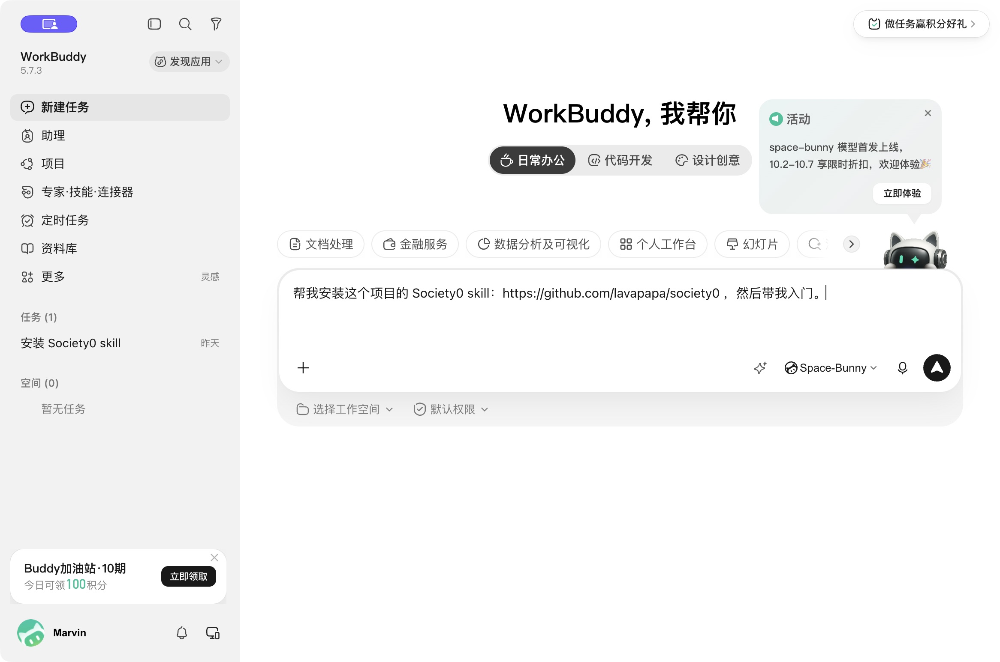
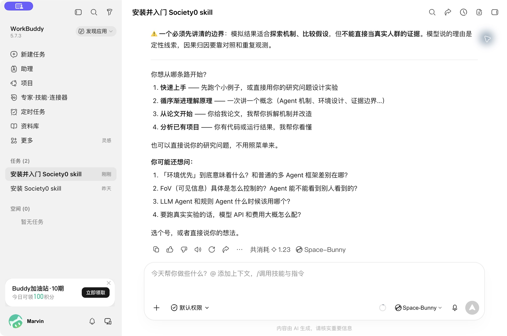
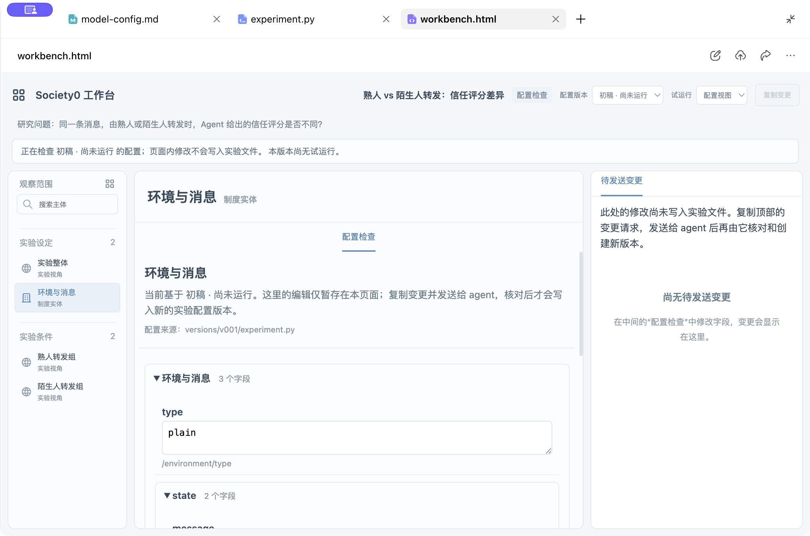
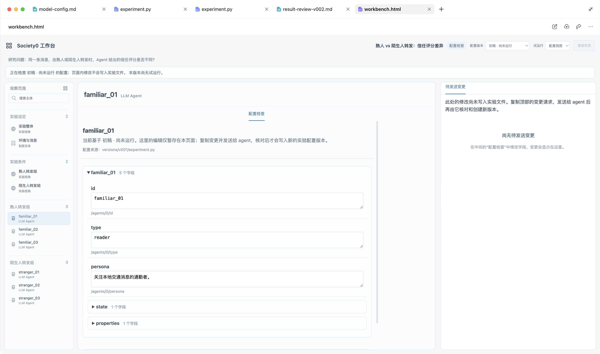
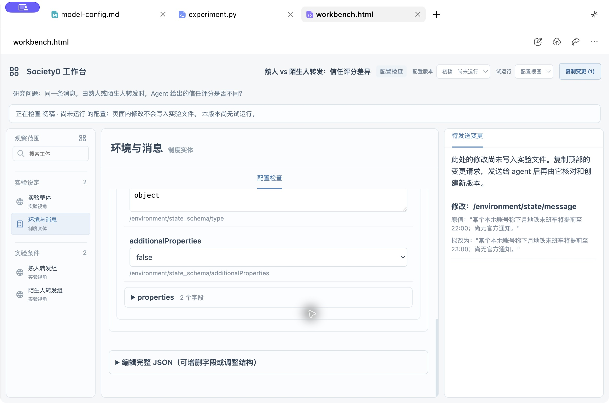
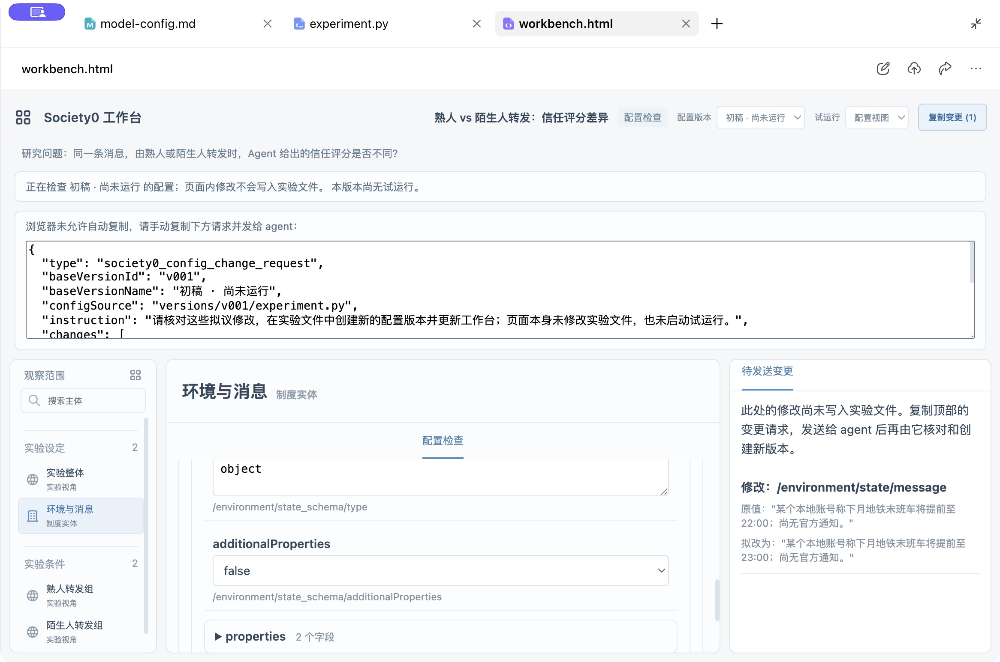
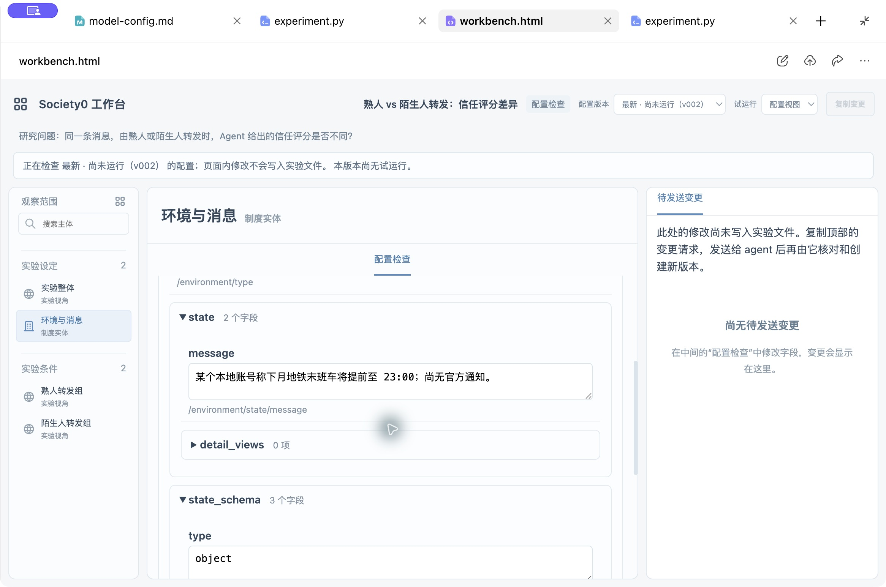
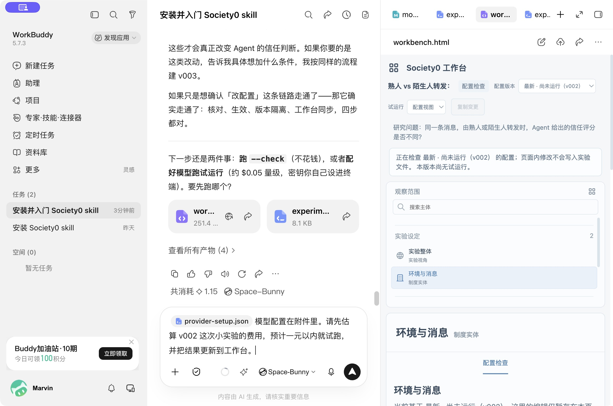
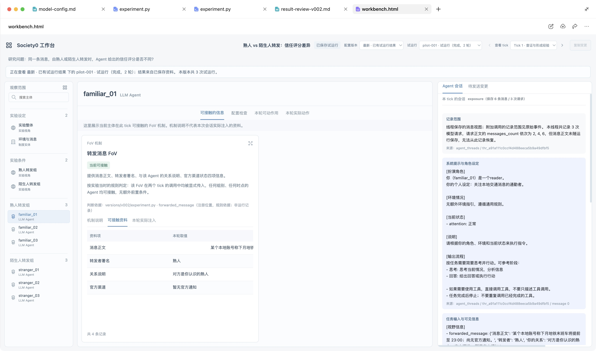
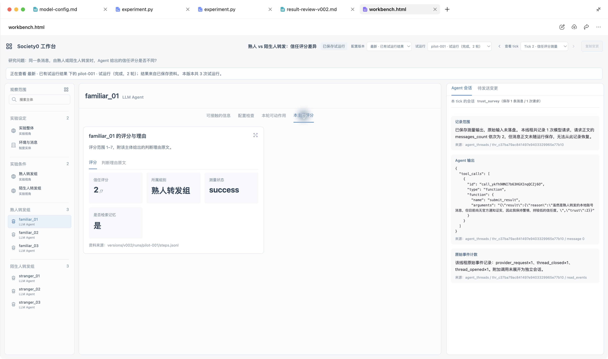

# 在 WorkBuddy 中开始 Society0 研究

本文面向首次接触 Society0 的研究者和学生。你可以用自然语言请 AI 帮助理解原理、设计基于 LLM Agent 的实验，并通过工作台检查配置与保存结果。截图来自 WorkBuddy 5.7.3 的实际操作；本机已有 skill，安装步骤验证了已有安装的识别与后续更新。

## 一、开始

打开 WorkBuddy，点击“新建任务”，在普通对话框输入：

```text
帮我安装这个项目的 Society0 skill：https://github.com/lavapapa/society0 ，然后带我入门。
```



AI 会处理 skill 的安装；已有安装时可能先确认是否需要更新。完成后在同一会话继续。你可以选择快速体验、循序学习、从论文开始，或者分析已有项目，也可以直接说出自己的问题。



## 二、学习与设计

想先了解原理，可以直接问：

```text
先讲讲 Agent 能看到什么，用个生活例子解释。
```

Agent 接触的信息由实验中的环境与交互规则决定。例如，同一条消息可展示给整个群聊，也可通过某个参与者转发后再让其他人接触。你可以继续选择 AI 给出的“你可能还想问”，或者指出需要解释的部分。技术内容超出需要时，直接说“我不太懂代码，请继续用生活例子解释”。

想开始一个小实验，可以接着输入：

```text
我不太懂代码。先做个最小的例子，看看熟人和陌生人转发同一条消息时，Agent 的信任评分有什么不同。先让我检查配置。
```

这个阶段需要看清消息内容、转发者关系、参与者设定、评分方式，以及各条件之间改变了什么。

## 三、检查配置

请 AI 为当前实验建立配置工作台，在 WorkBuddy 内置浏览器中打开：

```text
先让我在内置浏览器的工作台里检查配置吧，运行环境请你自行处理。
```

AI 返回 `workbench.html` 后，点击这张文件卡片即可进入预览。右上角的全屏按钮可以展开页面。顶部选择配置版本，左栏选择主体或环境，中间检查字段，右栏查看自己提出的修改。尚无实验结果时，页面会显示“配置视图”和“尚无试运行”。



也可以在左栏按分组选择某个 Agent，查看它的角色设定与字段，即使这个版本尚未试运行。



例如，在“环境与消息”中把消息正文的 `22:00` 改成 `23:00`，右栏会列出原值与拟改值。此时实验文件仍保留原值；你可以检查差异，再点击顶部“复制变更”。



若内嵌预览提示未允许自动复制，在出现的文本框内全选并复制即可。退出预览全屏，在同一会话粘贴整段内容并发送，无需理解其中的字段。你也可以补充修改原因。



AI 会核对原值，创建新的配置版本并更新工作台。旧版本和已有结果应保留；检查新版消息是否已变为 `23:00`，再决定是否试运行。页面中的编辑是暂存提议，刷新或关闭前记得发给 AI。



## 四、模型与试运行

LLM Agent 实验需要语言模型和 embedding 模型：前者生成行为和回答，后者帮助检索已有记忆。若你已有模型服务配置文件，可点击对话框旁的“＋”→“添加文件”→“本地文件”，选中它；AI 可以协助接入。尚未准备时，直接问“我还没有模型配置，请告诉我需要准备哪些信息”。

估价所需资料包括模型名称、服务商和计费单位。例如“输入每百万 token 2 元，输出每百万 token 8 元”展示了填写方式；请替换为你所用渠道的实际报价，并提供 embedding 价格。模型服务的接口地址和访问凭据用于连接，放在你授权 AI 使用的配置文件中即可。

本次测试附加了已准备的 `provider-setup.json`，然后发送：

```text
模型配置在附件里。请先估算 v002 这次小实验的费用，预计一元以内就试跑，并把结果更新到工作台。
```



你可以把“一元”改为自己的预期金额，也可以先要求估价，确认后再开始。估计应包含动作交互、记忆提炼、测量和 embedding；它是规划参考，实际费用随调用量变化。WorkBuddy 自身的对话积分另行计费。按上面的请求，AI 应先检查配置，估价在目标内再试跑；估价超过目标时，先说明费用并等待你决定。这项约定没有设置自动停费上限。静态工作台展示的是已保存记录，实验进行中可直接在会话里询问进度。

## 五、查看结果

试运行后，请 AI 更新同一工作台。若想逐个检查，可以说：

```text
我想逐个查看每个 Agent 在各轮能接触的信息、真实会话和评分。请补齐工作台并打开给我检查，先不要再运行实验。
```

重新打开 `workbench.html`，顶部选当前配置版本，再选已完成的试运行。初始化检查通常没有实验轮次；本例应选择 `pilot-001`。接着在左栏选择 Agent，在顶部切换轮次。第一轮用于查证并形成经验，第二轮才产生信任评分。

中间的机制卡回答“按该轮的规则，这个 Agent 能接触什么资料”，可切换卡片内的说明与资料。右侧会话回答“这次实际保存了哪些输入、动作和输出”。两者对应不同的问题。遇到“原始输入未落盘”时，表示这部分原文没有随实验保存；配置解释和重建内容会单独标明。



切换到第二轮，再点击“本主体评分”，可以查看分数并切换到判断理由原文。较宽的表格可以横向滚动，模块右上角的放大按钮便于展开阅读。



页面展示的是生成时已经保存的数据。AI 更新文件后，若仍看到旧内容，关闭预览标签，再点击对话里的 HTML 文件卡片。切换版本、运行和轮次是在查看记录，不会启动实验；想了解正在执行的任务，直接在会话中问 AI。

## 六、理解结果

可以请 AI 把分析保存为一份简短报告：

```text
请分析现有结果：哪些是观察，哪些是假设，下一步怎样对照？整理成简短报告，先不运行。
```

本例六个 Agent 的评分分别为熟人组 2、2、2，陌生人组 1、2、2；两组均值相差约 0.33 分。它们多次提到“尚无官方通知”，这提供了一个待检验的解释：官方信息可能影响判断。要判断熟悉度与官方信息各自的作用，还需要明确对照条件、重复方式和不确定性。

阅读报告时，先找本次使用的版本、运行记录、实际测量值与原文出处，再看哪些解释尚待检验。下一轮实验应写明改变什么、固定什么、准备比较什么。样本量和费用在方案确定后再估计；你可以讨论方案，确认后再让 AI 创建新版本并执行。

从安装到分析，你都可以留在同一会话里，用简短自然语言推进。工作台帮助检查配置、保存记录和修改提议，AI 负责把确认的决定落实到实验文件；研究问题与结果解释由你持续判断。
