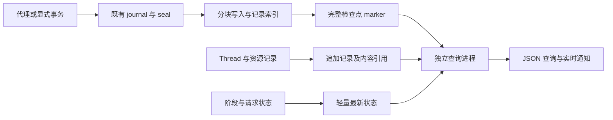

# Society0 实时观察与大规模产物：底层调查和设计判断

本文保存改造前调查与基线，文中的实现状态以调查时点为准。后续产品改造、独立审查和验收结果统一见[实施验收报告](acceptance-report.md)。

本次调查的对象是 Society0 的状态捕获、检查点、Agent Thread、资源记录和外部读取。近期实验作为负载样本，用来检验引擎在真实数据规模下的行为。建议推进一项跨持久化与读取机制的改造：保留声明式状态及增量 journal，以完整检查点确定结果可见范围，增加可按记录定位的存储和独立查询进程，再提供实时接口。这个方向需要先完成存储与一致性实验；当前证据不足以把“JSONL 分段加 RPC”作为完整方案。

## 一、证据

以下数字来自 2026-09-28 的只读调查和本地确定性实验，文件规模与记录分布保存在[产物采样摘要](artifact-sample-summary.json)。文件体积、源码行为和性能测量分别注明口径，便于判断结论能够支持到什么程度。

### 1.1 近期产物的真实规模

对两组近期实验目录统计了普通文件的逻辑字节数，包含组内分支、恢复段和失败诊断文件；它们可能保存共同历史的副本，因此这些数字描述实际管理负担，不代表独立仿真事实的数量。没有下载完整世界，没有在远端恢复 World，没有修改实验文件。

| 样本集合 | 普通文件数量 | 逻辑体积 | 检查点占比 | Thread 及其清单占比 |
| --- | ---: | ---: | ---: | ---: |
| A：近期五组重复实验 | 17,700 | 15.727 GiB | 70.5% | 17.0% |
| B：前一组多分支实验 | 18,071 | 13.266 GiB | 67.1% | 26.0% |

合计 35,771 个文件、28.993 GiB。远端文件系统为 `fuse.ceph-fuse`。遍历两组目录的元数据分别耗时约 8.3 秒和 7.2 秒；这是本次采样耗时，包含当时缓存与服务负载，不能当成固定性能指标。它已经足以排除“每次查看最新状态都遍历运行目录”的做法。

样本 A 中一段运行完成 24 个步骤后失败。其最后完整步骤的 replacement 文件压缩后为 10,696,891 字节。用有界缓冲逐字节扫描解压流，实际展开为 **137,117,466 字节，包含 204,882 条 replacement**；其中 191,067 条属于状态投影，最大单条约 2.79 MiB。扫描耗时约 31.4 秒，包含 Python 结构扫描成本，不能作为正式恢复耗时。这个样本说明：增量写入已经生效，单步增量本身仍可能很大，单条可替换值也可能达到 MiB 级。

另一段只执行了一个步骤的恢复运行，根 replacement 压缩后为 173,829,194 字节，占其 v4 文件总字节约 93%。gzip 尾部 ISIZE 为 1,879,249,233 字节，即约 1.75 GiB；ISIZE 对 4 GiB 取模，因此这里按展开长度的下界使用。这次没有完整解压该根组件，也没有测量其恢复峰值 RSS。跨目录恢复重新发布根状态的成本已经不能忽略。

前述 24 步运行的 events.jsonl 为 18.52 MB，其中 6,528 条心跳占 11.48 MB，约 62%。summary.json 为 9.86 MB，其紧凑表示中的 agent_batches 约 5.41 MB，包含按步骤展开的统计。该 summary 报告的产物总量为 189.6 MB，而对应运行的实际普通文件为 685.5 MB。源码中的 `_summarize_output_files` 没有覆盖 v4 子目录、Thread 和 Chroma；这个字段不能作为完整产物体积。

同一运行中最大的 Thread 为 2.65 MB、187 条事件，单行最大约 580 KB。`tool_execution_completed` 占 1.95 MB，`conversation_message` 占 0.48 MB。这些内容可能分别表示工具原始结果和模型实际看到的消息，调查没有证明两者完全相同；需要保留其语义并建立引用关系，不能按字段名称直接删除其中一份。

### 1.2 可复现的引擎实验

研究分支从 Society0 `7e98f11dcc4d5e0f5ace6ed73edca509d7e8e17a` 建立，分支名为 `codex/society0-runtime-observation`。本次远端样本的直接清单没有给出可独立确认的 Society0 Git 提交，因此实际文件尺寸与本地源码实验作为两类证据记录，不将它们冒认为同一构建的性能对照。

[诊断脚本](../../benchmarks/runtime_observation_probe.py) 使用临时合成数据，执行的都是现有核心 API；[测量结果](baseline-probe.json)保留完整数字。四个相关主测试文件共 65 项通过，覆盖声明式持久化、PersistenceManager、Thread 存储和运行检查点。随后确定性全量测试为 526 项通过、13 项真实端点测试排除，用时 26.51 秒；[测试记录](baseline-checks.json)保存运行条件。这是改造前基线，尚未证明新方案正确。

Thread 历史从 200 条增到 2,000 条时，文件从 0.896 MB 增到 8.964 MB。即使 `materialize_payloads=False`，每次读取仍读完全部 JSONL；Python 分配峰值从 3.08 MB 增到 30.75 MB，耗时从约 19 ms 增到 190 ms。该峰值来自 tracemalloc，不是进程 RSS。一次元数据读取还处理了约 65.6 KB 的 blob 正文。

另一个实验在临时 Thread 尾部放入 20 字节未完成记录，再通过 `AgentThreadStore(create=False).read_events()` 读取，源文件减少了 20 字节。当前读取入口的 [_read_thread_bytes_with_tail_recovery](../../src/society0/agent/thread_store.py#L662) 带有尾部修复行为。外部进程在写入尚未结束时调用它，有截断正在写入数据的风险；进程内 RLock 不提供跨进程保护。

对同一个可替换对象连续修改 10,000 次，seal 后得到一条约 65.7 KB 的 replacement。这是现有 journal 有意保留末值的效果。把这些修改改成逐次持久化或广播，工作量会由“一个最终对象”变为“10,000 次变更”。

通过 `PersistenceManager` 连续发布空增量，第 10、100、200 步发布后分别访问了 11、101、201 个历史 manifest；200 步累计遍历 20,300 个 manifest 条目；这是链条访问次数，同一父 manifest 在函数内部还可能被再次读取。对应单次发布约 1.5、5.7、9.9 ms，仅代表本机小样本。确定的问题是访问数量：完整发布路径通过 `committed_memory_epoch_ids()` 每步重新遍历父链，累计元数据工作量为二次增长。仅检查底层 writer 的增量字节数会漏掉这条路径。

## 二、机制

Society0 已经有为长期运行作出的结构性取舍。实时读取必须明确保留哪些取舍，以及在哪些边界补充新能力，否则很容易重新引入历史增长成本。

### 2.1 当前状态与证据分别怎样产生

透明代理在写入处完成声明解析和增量登记。[StateDeltaJournal._commit_proxy_write](../../src/society0/incremental_checkpoint.py#L996) 对嵌套 replacement 记录 `deferred_set`，到 `seal_tick` 才复制最终值；不可变追加事实独立保存。显式事务最终也进入既有持久化语义，实时功能需要覆盖两种状态模式。

[PersistenceManager.publish_delta](../../src/society0/persistence.py#L815) 可以积累多个已 seal 的步骤，再合成一个检查点 epoch。`V4CheckpointStore` 发布 replacement、append segment、Thread manifest 和记忆视图，最后发布 complete marker。这个机制需要保留配置的检查点频率；提高页面刷新率没有理由强制每步保存检查点。执行进度、最近完整检查点和查询索引处理到的位置，应分别报告。

Agent Thread 已经采用逐条消息存储，provider 请求主要保存消息数、工具名称和参数；4.1.0 已消除了每轮记录完整请求历史的主要重复。普通 Thread 事件不逐条 fsync，记忆 pending、receipt 和 Thread close 有明确持久化边界。外部实时接口需要说明“进程已写出可读取记录”与“记录已经获得恢复保证”的区别，不能为页面通知把所有事件改成同步 fsync。

Chroma 使用单库、分支和记忆 epoch 可见性。实时分析不能启动另一个不受原视图约束的记忆查询器。当前完整 epoch 集合还会复制到 World 和已创建的 Memory；应测量主体数与历史步数共同增长的成本，不能仅把 manifest 遍历移走便宣布这一问题结束。

### 2.2 早期统一 event 机制留下的约束

仓库保留了从状态代理构造 `StateChangeEvent`、在 Node transaction 中积累事件、写入 EventBatch、产生 replay 日志和 node diff、交给 StreamingBridge 的路径。[旧 schedule 的 _build_node_diff](../../src/society0/legacy/schedule.py#L767) 还会复制 old/new value。`transaction.Transaction.rollback` 丢弃待写事件，但不恢复内存 World；监听器错误也可以被记录后忽略。这样的事件路径无法直接承担恢复权威。

v4 设计文档明确把恢复变化来源转到声明与 journal，并说明 StateChangeEvent 的旧值会增加复制成本。后续 `76b9c04` 又专门让关闭状态事件时避开快照复制。以上证据能够解释当前架构为何把恢复与观测分开；当年整个统一 event 方案失败的完整过程，现有提交材料不足以全部还原。

一个余额字段变更既不天然等于一次完整 Action，也不天然等于一个已提交步骤。跨字段语义由调用方和现有事务决定；Thread 中的外部请求已经发生，即使步骤最终失败，其费用与响应记录仍然存在。统一时间戳或全局序号可以帮助展示顺序，却无法凭空赋予这些记录相同的原子性。

## 三、风险

当前最需要控制的是数据在生产、封存、编码、压缩和读取时产生的副本，以及观察者追赶不上运行时的积压。RPC 协议本身无法改变这些成本。

### 3.1 内存和磁盘怎样继续增长

World 持有累计事实，journal 持有新增事实及被修改对象，待发布 epoch 可能持有多个步骤增量。[_write_gzip_component](../../src/society0/incremental_checkpoint.py#L1253) 同时构造完整 JSON 字节和完整压缩字节；恢复又要解压、解析组件并建立 World。根发布前的 `_plain_snapshot_value` 和 `_v4_root_entries` 仍有全量物化。单步 131 MiB 的 replacement、1.75 GiB 以上的根状态进入这些路径时，压缩后的文件大小无法代表峰值内存。

在这些结构旁边再增加完整事件对象队列、World 快照和内存查询索引，会继续增加常驻数据。粗略资源模型应包含 `World 历史 + 未发布增量 + 当前编码缓冲 + 活跃 Thread + 观察队列 + 查询缓存`，并分别测量。即使新观察队列有界，World 自身保存累计事实的增长仍然存在。

“可替换 entry”也没有自动的字节上界。真实样本出现了单条 2.79 MiB 的值；一个页面的 100 条记录可能远超预期响应大小。分页同时需要记录数和字节预算，大对象通过完整内容引用或流式下载取得。引用不能成为裁剪主体历史、原始工具结果或研究证据的手段。

运行恢复会再次发布根，异常终止还可能保存完整诊断快照。分叉和重试越多，相同历史重复存储越明显。共享不可变来源组件可以减少磁盘复制，但仍使用当前内存 World 时，仿真恢复依然需要完整状态。查询服务应能直接访问存储中的记录，避免为了画图再恢复一个同等大小的 World。

### 3.2 实时性和一致性怎样冲突

同步环境函数通过 `invoke_maybe_async` 直接在事件循环中执行。若某个计算段长期不让出执行权，同一事件循环中的心跳和 RPC 都会延迟。独立查询进程可以继续报告最后观测时间和进程存活信息；它无法获知生产者尚未主动发布的内部进展。应分别提供状态观测年龄、最新完整检查点和分析处理进度，禁止用心跳仍跳动表示业务仍在推进。

正在运行的 World 已经包含下一步的修改。返回“只读视图”只能限制调用方写入，不能把它变成上一个完整检查点的快照。跨两页读取时还可能遇到下一次提交。查询必须绑定明确的检查点身份，并从对应的不可变记录或版本化索引取值。

长期稳定要求平均消费能力超过相应数据的产生速度。慢浏览器、断开的 Agent 和落后的分析进程不能使引擎不断积累对象。只发送短引用、合并重复状态提醒，消费者按持久游标补读；积压量以字节和步骤报告。分析服务落后可以降低数据新鲜度，不能偷偷漏掉研究事实。

若持久介质本身写不动，有限内存、无损记录、无限制继续仿真三者无法同时成立。底层必须在明确的字节阈值处等待持久化，或以已有故障语义终止。这里只对观察与写盘资源施加约束，不压缩模型历史、动作预算或主体能力。

## 四、方案

外部使用至少包含查看运行进度、跟踪一个主体的完整交互、在固定步骤查询状态，以及结束后跨步骤分析。不同读取需要共享身份与提交规则，同时使用适合其数据量的存储访问方式。

### 4.1 三种改造深度

| 方案 | 能解决什么 | 代价与未解决问题 |
| --- | --- | --- |
| A：保留所有存储，增加轻量进度和专用只读 Thread 分页 | 快速查看进度、增量读取交互；改动集中 | 大型状态查询仍需解压与恢复，根复制和单步编码峰值继续存在。适合作为早期可用切片，无法完成整项任务。 |
| B：保留代理和 journal，改造分块存储、提交引用和独立查询 | 让增量数据可直接查询；控制编码缓冲与观察队列；统一运行中和结束后的读取语义 | 涉及存储格式、根与增量发布、读取索引、Thread、调度记录和故障语义，需要完整跨层验收。作为当前优先验证方向。 |
| C：进一步把累计状态改为磁盘支持的 Mapping/Sequence，或数据库状态后端 | 有机会降低 World 常驻历史内存，并提供版本查询 | 影响随机访问、透明代理、显式事务、迭代顺序、序列化及环境扩展。先测真实 World 的 RSS 和访问分布，再决定是否必须纳入主线。 |

将所有状态变化改成统一 event sourcing，会同时改变写入接口、原子性、恢复与外部 API，现有证据没有证明这种整体替换更合适。方案 B 利用已经建立的声明式语义；如果 World 自身的历史内存仍超过目标资源，方案 C 可以在相同状态接口下继续研究。

### 4.2 与现有机制共存的方式

建议以一次完整提交及其组件引用组织状态读取。代理继续登记 journal，seal 继续确定步骤末值，存储 writer 接收已有所有权的增量；writer 逐块编码压缩并生成记录位置索引，complete marker 发布后才让读者使用这些记录。通知携带提交 ID、来源组件、序号范围和字节范围，通知队列不保存整份 payload。

状态、Thread 和资源记录保留各自顺序，用运行、步骤、checkpoint、Thread、request 等身份关联。某个 Thread 的事件已经可读，并不表示包含它的 World 步骤已经提交。外部响应同时给出来源位置与可见范围，跨源读取不伪装成全局原子快照。

分块应同时解决增量和根发布：迭代生成记录，限制编码缓冲，在写入时生成位置索引，恢复和查询按块读取。不能先生成完整 JSON 再切块，也不能由查询进程重新扫描整份世界才能找到最新记录。单条超大值需要独立内容引用或流式表示；最大记录、块大小和并发解码量必须共同进入内存预算。这里属于存储格式改造，格式版本随实现正式确定。

新运行若引用以前的不可变检查点组件，应明确保存来源和依赖，避免每次恢复都再保存一份完整根。跨目录移动、导出离线包、保留来源和组件回收必须遵循同一依赖关系。共享来源减少磁盘重复，不等同于消除了恢复时的 World 物化。

查询索引可以使用 SQLite 保存记录位置和明确需要的查询字段，大对象仍引用权威产物。调查环境使用 Ceph FUSE，不能假定可在该共享目录直接启用 WAL；SQLite 官方要求 WAL 使用者位于同机并依赖共享内存，长期读事务还可能妨碍 checkpoint 并使 WAL 增长。因此索引优先评估服务端本地存储，持久产物仍放在既有产物存储中；实际部署需核实本地存储位置和故障后重建时间。[SQLite WAL 文档](https://www.sqlite.org/wal.html)

运行结束后继续使用同一索引和原始组件。固定检查点的分页使用稳定键和明确的读取版本，避免跨页混入新步骤。已登记索引的筛选可以给出精确总数；任意跨表分析可能需要完整扫描，应提供明确的分析任务及进度，不能承诺任何筛选都即时返回精确总数。大批量分析由独立进程输出数据集，页面返回结果引用。

JSON-RPC 可以表达 status、thread page、state page、watch 和结果导出等调用，但它本身没有定义传输、断线续读、持久性或背压。[JSON-RPC 2.0 规范](https://www.jsonrpc.org/specification) 本机 socket、HTTP/SSE 以后均可映射到相同读取语义。优先确定提交、游标、字节预算和查询版本，再决定传输适配器；不会以实时连接成功作为架构验收。

## 五、改动

这项工作至少穿过状态捕获、存储和查询三个边界。实施应围绕完整读取链建立垂直切片，下面列出的模块属于同一设计，不各自引入一套事件和状态副本。

### 5.1 需要改到哪些底层

`incremental_checkpoint.py` 与 `persistence.py` 承担主要结构改动：有界分块编码、记录定位、根与增量共用写入格式、发布后游标、来源组件依赖，以及消除每次发布的完整 manifest 链重读。journal 合并末值的语义继续保留；是否进一步将超大未发布增量分批暂存，需要用单步规模实验决定。记忆 epoch 集合更新同时检查复制成本和可见性，不改变记忆内容。

`agent/thread_store.py` 需要真正独立的只读分页入口，观察者不得修复尾部、补换行或截断文件；查询事件元数据时不加载 blob。追加记录的物理位置和可读取边界应由写入方维护。当前打开新 Thread 时还会以 `*/thread_id.jsonl` 检查既有文件，读取路径也依赖目录查找；长期运行需要在创建时登记位置，避免每次查询或打开新 Thread 都搜索历史步骤目录。封存后的 Thread 索引缓存需要生命周期管理，当前 `_thread_indexes` 没有移除入口，数量随历史 Thread 增长。模型使用的完整消息读取仍保持原有内容语义。

`schedule.py`、`society.py`、`logging/context.py` 需要统一通用运行身份与记录引用，减少每条心跳重复携带的静态配置，把常变计数保存在小型状态中。完整步骤产物与 marker 的可见顺序一起改造，支持一个 epoch 含多个步骤；summary 分离小型运行摘要和可分页的历史统计。StepResult 的大表须允许写入数据集并返回引用，避免先在内存里组装整表再重复转成 JSON。

外部查询进程消费已发布引用，管理版本化记录索引与有界缓存。查询服务损坏可以重建，其错误不把已提交仿真改成失败；权威记录写入失败则继续由引擎失败语义处理。查询索引和 marker 不跨介质做伪原子提交：索引事务完成后才推进 `indexed_checkpoint`，进程中断后从上一位置继续，读者能看到落后范围。

### 5.2 旧路径清理

新分支的清理目标包括 `sim_engine.py`、`streaming.py`、`diff_dispatcher.py`、旧 YAML schedule 及其专用 replay/index 输出、已停用的 `event_logger.py` 占位模块，以及对应旧测试和文档入口。清理以导入和调用关系为依据。

`transaction.EventLogger`、`EventBatch`、`World` 的部分上下文能力仍由代码驱动路径使用；不能因为它们最早服务 SimEngine 就整批删除。应提取当前路径仍需要的最小记录能力，再删除旧 listener、replay、node diff 和兼容入口。PersistenceManager 仍创建的旧 events/diffs 目录也随消费者删除。完成后测试当前公共 API、内置环境、Thread 和记忆路径，确认没有残留的旧模块依赖。清理不建立兼容层。

## 六、验证

完整验收需要同时证明语义保持和资源开销受控。当前完成的是调查与基线实验；后续性能结论必须来自同一数据、同一提交条件下的对照。

### 6.1 先做能够否定方案的实验

第一组固定活动对象与本步增量，扩大历史到原来的 10 倍、100 倍，统计状态查询与增量发布读取的历史组件数、处理字节和缓存大小。第二组固定历史，扩大本步 replacement 数量、追加数据和最大单条值，至少覆盖本次见到的约 20.5 万条 replacement、131 MiB 展开增量和 MiB 级单条记录。分别计量 seal、编码、压缩、写盘、Thread 读取、索引更新和首次恢复，报告进程 RSS、Python 分配峰值及 I/O；两种内存指标不可混用。

第三组让仿真持续生成数据，同时接入正常读取者、断连读取者和低于生产速率的慢读取者，观察队列、索引积压、文件数量与服务响应。第四组在根发布、组件写入、marker 发布、索引事务、通知和进程关闭之间注入故障，并覆盖 Thread 半行、超大记录、跨页新提交、来源组件被保留、旧步骤查询以及多步骤 epoch。验证能够读到全部原始记录，失败步骤不会成为已提交状态。

状态更新后的外部可见延迟可先以本机约 1—2 秒作为试验目标，但必须同时给出生产者上报间隔、查询服务响应、检查点发布时间和索引滞后。同步长计算期间显示进展过期；索引未处理完时显示最后可查询检查点。下一阶段根据实测确定时效目标与资源预算，当前不承诺任意状态每秒一致可查。

### 6.2 当前完成范围与未决项

独立工作树和分支已建立；相关测试 65 项及确定性全量测试 526 项通过，13 项真实端点测试排除；增长、读取副作用、blob 读取和 journal 合并实验已完成。远端完成两组目录的元数据统计、两个运行的记录结构抽查，以及一个大增量组件的流式结构扫描。没有修改 Society0 产品代码，没有修改产业环境，也没有启动正式仿真或调用模型服务。

仍需要测量真实仿真进程的峰值 RSS、根恢复分阶段成本、Ceph 上分块写入及跨进程可见延迟、查询索引首次构建与持续消费吞吐。这些数据决定方案 B 是否足够，以及磁盘支持的 World 是否必须成为本次改造的一部分。不能用当前本地毫秒级小实验推断远端 GiB 级状态的运行表现。

本次判断是：实时性必须连同产物的物理表示、读取隔离和增长上界一起设计。应先保留现有状态写入语义，建立可定位、可提交、可按需读取的数据路径，完成大规模对照，再接入外部 RPC。这样才能让实时观察和结束后分析共用可信产物，并控制观察功能自身带来的成本。
